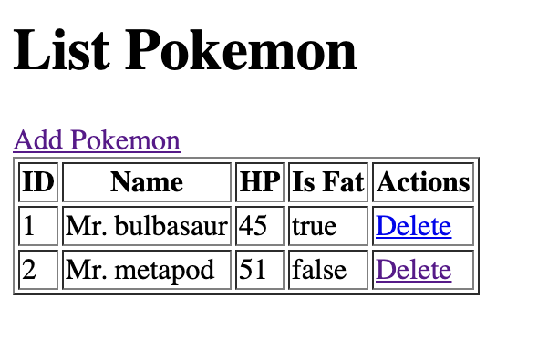
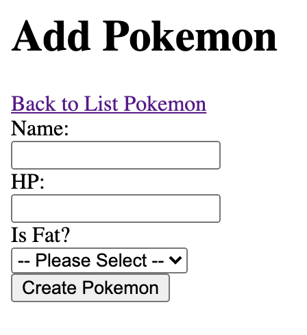
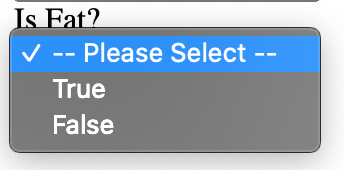

# Pokemon Application

_⏰_ Time Estimation ~90 minutes

### Preparation Test Phase 1 Week 3

Sebuah perusahaan bisnis game meminta anda untuk membuat aplikasi yang dapat membaca, menambahkan, dan menghapus data pokemon.

## Release 0
Buatlah *DATABASE* dengan menggunakan PostgreSQL dengan nama `pokemondb`.
> Nama database WAJIB pokemondb.

## Release 1
Buatlah file `setup.js` yang berfungsi untuk membuat table `Pokemons` yang memiliki kolom-kolom sebagai berikut:

| Field         | Datatype | Modifiers   |
| ------------- | -------- | ----------- |
| id            | SERIAL   | PRIMARY KEY |
| name          | VARCHAR  | NOT NULL    |
| HP            | INTEGER  | NOT NULL    |
| isFat         | BOOLEAN  | NOT NULL    |

Jalankan file `setup.js` untuk membuat table `Pokemons` di dalam database `pokemondb`.

## Release 2
Buatlah file `seed.js` yang berfungsi untuk melakukan seeding data ke dalam table `Pokemons` berdasarkan data dari `pokemons.json`.

Jalankan file `seed.js` untuk melakukan seeding ke table `Pokemons`.

## Release 3

Buatlah routing dengan menggunakan `ExpressJS` agar dapat melakukan CRUD operations dengan detail sebagai berikut:

| Method | Route             | Keterangan                                                                                                               |
| ------ | ----------------- | ------------------------------------------------------------------------------------------------------------------------ |
| GET    | /                 | Menampilkan semua pokemon yang ada dalam database                                                                        |
| GET    | /pokemons/add     | Menampilkan halaman form untuk menambahkan data pokemon                                                                  |
| POST   | /pokemons/add     | Menerima data yang dikirim dari halaman `/pokemons/add` untuk melakukan _insertion_ ke dalam table `Pokemons`            |
| GET    | /pokemons/delete/:id | Melakukan _delete_ data pokemon berdasarkan `id` yang dikirimkan                                                      |
> di preparation test ini tidak ada edit, tapi di livecode nanti pasti ada

## Release 4
### Halaman Home atau Route `/`
Implementasikan routing `/` dengan membuat halaman `Home` dimana halaman ini menampilkan semua pokemon yang ada pada database dalam bentuk list yang terdiri dari kolom ID, Name, HP, Is Fat, dan Actions.

Pada kolom action terdapat sebuah link yaitu `delete` yang akan mengarah ke `/pokemons/delete/:id`.

Tambahkan `Mr.` pada data di kolom Name seperti pada screenshot contoh berikut:

### Halaman Add Pokemon atau Route `/pokemons/add`
Halaman add akan menampilkan form untuk memasukkan data pokemon yang akan disimpan ke dalam database.

Untuk bagian `Is Fat` menggunakan select input yang terdapat 3 pilihan:
  - True
  - False

> di preparation test ini tidak ada validasi untuk add, tapi di livecode nanti pasti ada.

Apabila berhasil menambahkan pokemon maka halaman akan redirect ke home atau `/`

## Release 5
### Delete Pokemon atau Route `/pokemons/delete/:id`
Untuk mengimplementasikan routing ini, kamu tidak perlu membuat halaman baru, tapi cukup dengan menekan tombol delete yang akan mengarahkan routing ke `/pokemons/delete/:id` dimana proses delete akan dilakukan berdasarkan `id` yang dikirimkan. 

Apabila berhasil menghapus pokemon maka halaman akan redirect ke home atau `/`

**NOTE**
Untuk pesan error bisa ditampilkan dengan menggunakan `res.send`. Pesan error bebas selama yang ditampilkan jelas dan sesuai dengan error yang terjadi.
